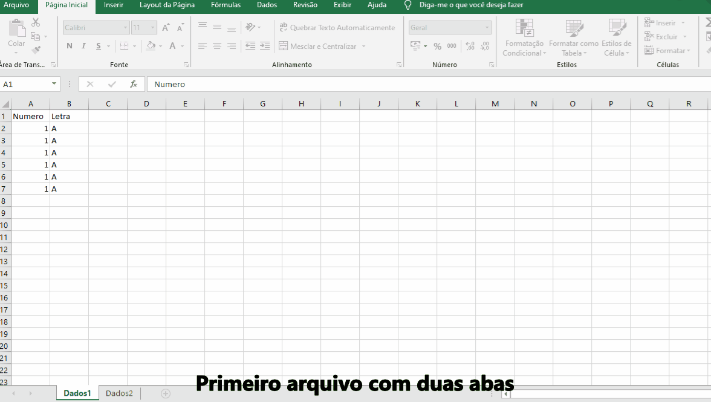

```{r setup, include=FALSE}
knitr::opts_chunk$set(echo = T,
                      message = F, 
                      warning = F, 
                      dev.args = list(bg = 'transparent'),
                      cache.rebuild = F,
                      fig.align = "center",
                      cache = F)
```

Muitas vezes nos deparamos com planilhas de Excel com os dados dividídos em intermináveis abas e ainda por cima separadas em diferentes arquivos. As instruções abaixo são para quem quer uma maneira fácil e rápida de unificar tudo isso em uma única planilha. 

Para o exemplo criei três arquivos excel, cada um contendo duas abas, uma com duas colunas, e outra com três.


{width = "50%"}

### Bibliotecas

```{python}
import os
import pandas as pd
```


###

