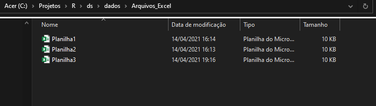

```{r setup, include=FALSE}
knitr::opts_chunk$set(echo = T,
                      message = F, 
                      warning = F, 
                      dev.args = list(bg = 'transparent'),
                      cache.rebuild = F,
                      fig.align = "center",
                      cache = F)
```

Muitas vezes nos deparamos com planilhas de Excel com os dados dividídos em intermináveis abas e ainda por cima separadas em diferentes arquivos. As instruções abaixo são para quem quer uma maneira fácil e rápida de unificar tudo isso em uma única planilha. 

Para o exemplo criei três arquivos excel, cada um contendo duas abas, uma com duas colunas, e outra com três.


<p align="center">



</p>

No GIF abaixo está um exemplo de como são os arquivos.

<p align="center">


</p>


### Bibliotecas

```{python}
import os
import pandas as pd
```


### Diretório onde estão as planilhas

```{python}
# Caminho do diretório que contém os arquivos
diretorio = 'C:/Projetos/R/ds/dados/Arquivos_Excel'
arquivos = os.listdir(diretorio)

# Listar os arquivos no diretório
arquivos
```


### Loop para extrair as planilhas das abas e dos arquivos

```{python}
# Cria um arquivo vazio para armazenar os dados
df_combinado = pd.DataFrame()

# Loop para abrir cada arquivo excel
for arquivo in arquivos:                         
    
    # Cria o caminho para cada arquivo
    nome_arquivo = [diretorio + "/" + arquivo][0]
    
    # Testa se os arquivos terminam com .xlsx
    if nome_arquivo.endswith('.xlsx'):
        
        # Abrea o arquivo e cria uma lista com o nome das abas
        arquivo_exel = pd.ExcelFile(nome_arquivo)
        abas = arquivo_exel.sheet_names
        
        # Loop para abrir cada aba
        for aba in abas:
          
            # Armazena cada planilha de cada aba em 'df' e adiciona ao 'df_combinado'
            df = arquivo_exel.parse(sheet_name = aba)
            df_combinado = df_combinado.append(df)

# Visualiza o arquivo combinado            
df_combinado
```


