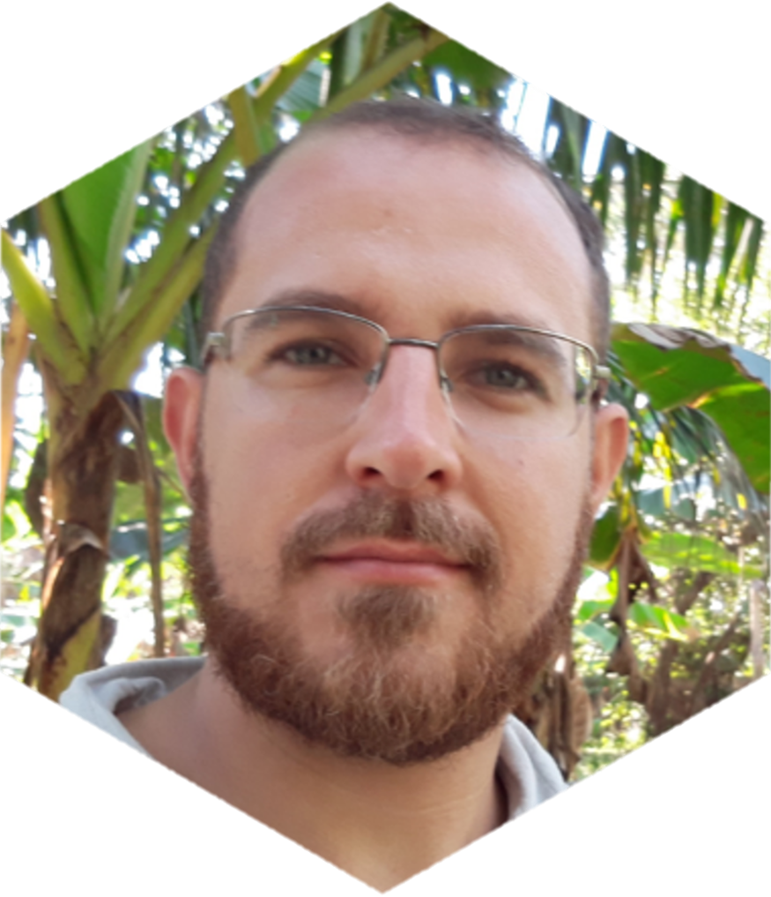

```{r setup, include=FALSE}
knitr::opts_chunk$set(echo = FALSE)
```


</br >



</br >

Eu sou Leonardo Donato Nunes, Biólogo, Cientista de Dados e Estudante de Matemática. 

Desde que comecei a trabalhar com dados, me apaixonei por pegar informações de uma fonte bagunçada e sem nenhum padrão e transformar em um arquivo limpo e funcional de onde se pode extrair valor. Comecei a estudar cada vez mais os processos e ferramentas de obtenção e limpeza de dados, estatística, visualizações de dados e divulgação de resultados. Gosto muito de leitura e de estar em constante aprendizado.

Minhas áreas de interesse são:
Estatística; Ciência de Dados; Análises de Dados; Meio Ambiente; Mercado Financeiro; Tecnologia; Educação, e tudo que envolva aprendizado e desenvolvimento pessoal.

Trabalho a nove anos como biólogo, profissão que amo e me dedico. Depois de formado, em 2013, logo fui apresentado a estatística e a programação, e desde então me aprofundei na área de análise de dados e mais recentemente na ciência de dados. 

Gosto muito de programar em R, minha primeira linguagem e a que mais utilizo, mas ao longo da minha vida profissional precisei aprender SQL e Python. Gosto muito de estatística, tenho experiência com estatística descritiva, medidas de posição e dispersão, testes de hipóteses, análises de variância, correlação e regressão. Trabalho muito com modelos lineares generalizados para dados de contagem.

## Sobre a página

Criei a página com a intenção de compartilhar meus aprendizados e descobertas, e também para demostrar minhas habilidades de uma maneira organizada e fácil. Os temas principais que vou seguir são **programação** (**R**; **Python**; **SQL**), **estatística**, **matemática** e **visualização de dados**. 

Aqui vou publicar meus projetos de Ciência de Dados e alguns tutoriais que faço, principalmente para mim mesmo. As vezes passo muito tempo pesquisando para criar um código que resolva meu problema e uma página bem organizada e dividida é um bom ambiente para ter esse aprendizado de forma mais direta.

Optei por escrever as publicações e toda a página em português. O principal motivo é que consigo expressar melhor o que pretendo dizer. Segundo, existe muito material disponível em inglês, e acredito que estarei contribuindo mais para a comunidade brasileira fazendo minhas publicações em português.

</br >


